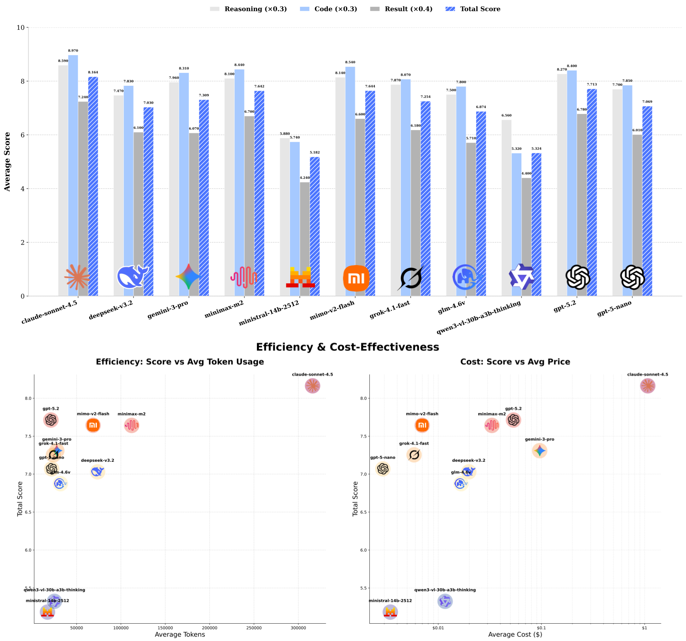

<div align="center">
  <br><br>
  <h1>DSAEval</h1>
  
  <br>

  <a href="https://github.com/AMA-CMFAI/DSAEval">
    
  </a>
  &nbsp;&nbsp;
  <a href="https://dsaeval.github.io/DSAEval/">
    
  </a>
  &nbsp;&nbsp;
  <a href="https://dsaeval.lambda.org.ai/">
    
  </a>
  &nbsp;&nbsp;
  
</div>

**Evaluating Data Science Agents on Real-World, Open-Ended Problems**

DSAEval is a challenging benchmark for evaluating **LLM-powered data science agents** across **641 real-world problems** drawn from **285 diverse datasets** (tabular, image, text).  
It focuses on:

- Fully open-ended tasks  
- Multimodal understanding  
- Iterative multi-turn tool usage & reasoning  
- Multi-dimensional scoring (reasoning quality + code correctness + final result fidelity)

→ [Official Website](https://dsaeval.github.io/DSAEval/)  
→ [Live Agent Runs & Viewer](https://dsaeval.lambda.org.ai/) (browse conversations, generated figures, reports)

## Quick Start

### 1. Clone & Install

```bash
git clone https://github.com/AMA-CMFAI/DSAEval.git
cd DSAEval
```

```bash
# Recommended: use conda
conda create -n dsaeval python=3.10 -y
conda activate dsaeval

# Install dependencies
pip install -r requirements.txt
```

### 2. Register Jupyter Kernel (recommended)

Makes it easier to open and debug the generated `.ipynb` files:

```bash
pip install ipykernel
python -m ipykernel install --user --name dsaeval --display-name "DSAEval (3.10)"
```

### 3. Download Datasets

```bash
# Download the raw datasets
python dataset_download.py
```

Download the **soft ground-truth figures** from Google Drive:

🔗 [Figures – Google Drive](https://drive.google.com/file/d/1RJ--0uYTEIY4MO3A1CyFMvMNoaKLTD0U/view?usp=drive_link)

After downloading:
1. Unzip the file
2. Move the extracted folder into the project root (next to `dataset_download.py`)

## Running Evaluations

You need access to an **OpenAI-compatible** chat completions API (OpenRouter, Anthropic, OpenAI, Grok, Gemini, etc.).

Example command:

```bash
python runner.py \
    --model "anthropic/claude-sonnet-4.5" \
    --api_key "sk-......your-key......" \
    --base_url "https://openrouter.ai/api/v1" \
    --qra_path "./dsaeval.json" \
    --log_path "./agent_logs" \
    --session_path "./agent_sessions"
```

### Main CLI Flags

| Flag              | Description                                      | Example / Default                          |
|-------------------|--------------------------------------------------|--------------------------------------------|
| `--model`         | Model name (OpenAI-style)                        | `openai/gpt-4o-mini`                       |
| `--api_key`       | Your API key                                     | `sk-or-v1-xxxx`                            |
| `--base_url`      | API base endpoint                                | `https://openrouter.ai/api/v1`             |
| `--qra_path`      | Path to benchmark JSON                           | `./dsaeval.json`                           |
| `--max_it`        | Max iterations per task                          | `20`                                       |
| `--log_path`      | Directory for logs & reports                     | `./agent_logs`                             |
| `--session_path`  | Directory for sessions (chats, figures, etc.)    | `./agent_sessions`                         |
| `--time_out`      | Per-step timeout (seconds)                       | `6000`                                     |
| `--is_multimodal` | Enable multimodal / vision support               | (flag, default off)                        |

Full help:

```bash
python runner.py -h
```

## Output Files

For each task, a folder is created in `log_path` (named roughly `{model}_{category}_{id}_*`):

- `_log.json`          — detailed execution trace  
- `_final_report.txt`  — final judgment & score rationale  
- `_code.ipynb`        — generated Jupyter notebook

After all tasks finish:

- `{model}_YYYY-MM-DD_all.json` — overall summary & aggregated scores

## Scoring & Leaderboard

After running experiments, you need execute evaluation.py.

Example command:

```bash
python evaluation.py \
  --api_key "sk-......your-key......" \
  --base_url "https://api.your-provider.com/v1" \
  --eval_model "anthropic/claude-haiku-4.5" \
  --logs_dir "./agent_logs" \
  --ground_truth "./data/ground_truth.json" \
  --output_dir "./evaluation_results" \
  --concurrency 10
```
### Main CLI Flags

| Flag               | Description                                      | Example / Default                          |
|--------------------|--------------------------------------------------|--------------------------------------------|
| `--api_key`        | API key for authentication                       | `sk-xxxx-xxxx`                             |
| `--base_url`       | Base URL for the model API                       | `https://openrouter.ai/api/v1`             |
| `--eval_model`     | Model name used for evaluation                   | `anthropic/claude-haiku-4.5`               |
| `--target_models`  | Comma-separated list of model paths to evaluate  | ["deepseek-v3.2","gemini-3-pro",...]       |
| `--start_index`    | Start index for evaluation                       | `0`                                        |
| `--batch_size`     | Number of items to evaluate                      | `None` (Runs until end)                    |
| `--concurrency`    | Model parallelism per process                    | `10`                                       |
| `--logs_dir`       | Root directory where agent logs are stored       | `./agent_logs`                             |
| `--ground_truth`   | Path to the ground truth JSON file               | `./ground_truth.json`                      |
| `--image_dir`      | Base directory for reference images              | `./images`                                 |
| `--output_dir`     | Directory to save evaluation results             | `./eval_results`

Then visit:

- 🌐 [Official Leaderboard & Results](https://dsaeval.github.io/DSAEval/)  
- 👀 [Live Viewer – All Agent Runs](https://dsaeval.lambda.org.ai/) (real-time chats, figures, reports)

## Supported Models

Any model that exposes an **OpenAI-compatible `/chat/completions`** endpoint works, including:

- Anthropic Claude family  
- OpenAI GPT series  
- Google Gemini  
- xAI Grok  
- Many open models via vLLM, Together, Fireworks, DeepInfra, etc.

Add `--is_multimodal` for vision-capable models.

[//]: # (## Citation)

[//]: # ()
[//]: # (If you use DSAEval in your research, please consider citing the project:)

[//]: # (```bibtex)

[//]: # (@misc{dsaeval2025,)

[//]: # (  title  = {DSAEval: Evaluating Data Science Agents on Real-World Problems},)

[//]: # (  author = {AMA-CMFAI},)

[//]: # (  year   = {2025},)

[//]: # (  url    = {https://github.com/AMA-CMFAI/DSAEval})

[//]: # (})

[//]: # (```)

---

If you find this benchmark helpful, please consider giving the repo a ⭐!  
Bug reports, new task suggestions, and pull requests are very welcome.
